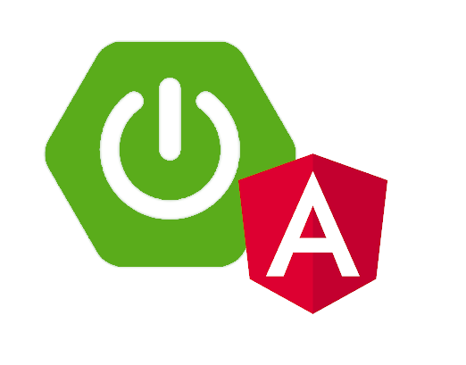

# *Angular / SpringBoot / Java Developer* 👋

#### [Latest repo on Enterprise Angular Monorepo](https://github.com/majidhajric/web-shop)

#### [Previous Enterprise Spring Cloud](https://github.com/majidhajric/spring-cloud-examples)

## INTRODUCTION

Ihave been working as a back-end developer involving agile softwaredevelopment practices,analysis, design, implementation, deployment and testing of Javaenterprise applicationsand web applications. Ithrive in a team environment and work well with others. Enjoy workingas a team memberas well as independently.
My skills includes architecting Enterprise Angular applications using DDD and Nx monorepo workspace, backed with Spring Boot backend.
So far worked with SOAP, REST, RSocket and know something about GraphQL, SQL and Mongo databases.

Strongthirst for knowledge. Constantly improving skills by learning anddoing.

## SKILLS

- Java and Object-oriented programming (OOP)
- Spring Boot and Spring Framework
- Relational databases and SQL, JPA / Hibernate, MongoDB
- Maven, Git, Docker, Shell, Jenkins
- HTML, CSS, JavaScript
- Angular	Framework, NgRx, Nx --fix

---

## WORKEXPERIENCE

09/2021–PRESENT SoftwareDeveloper BITConEx
06/2020–09/2021 Freelance WebDeveloper
05/2018–10/2019  JavaDeveloper CyloMedia UK

## EDUCATION

09/2016–10/2017	BILD-IT Professional Training  [www.mozemo.ba](https://www.mozemo.ba) 👍

## LANGUAGE

Bosnian, Serbian, Croatian, English

## CONTACT

[majidhajric@gmail.com](mailto:majidhajric@gmail.com)

